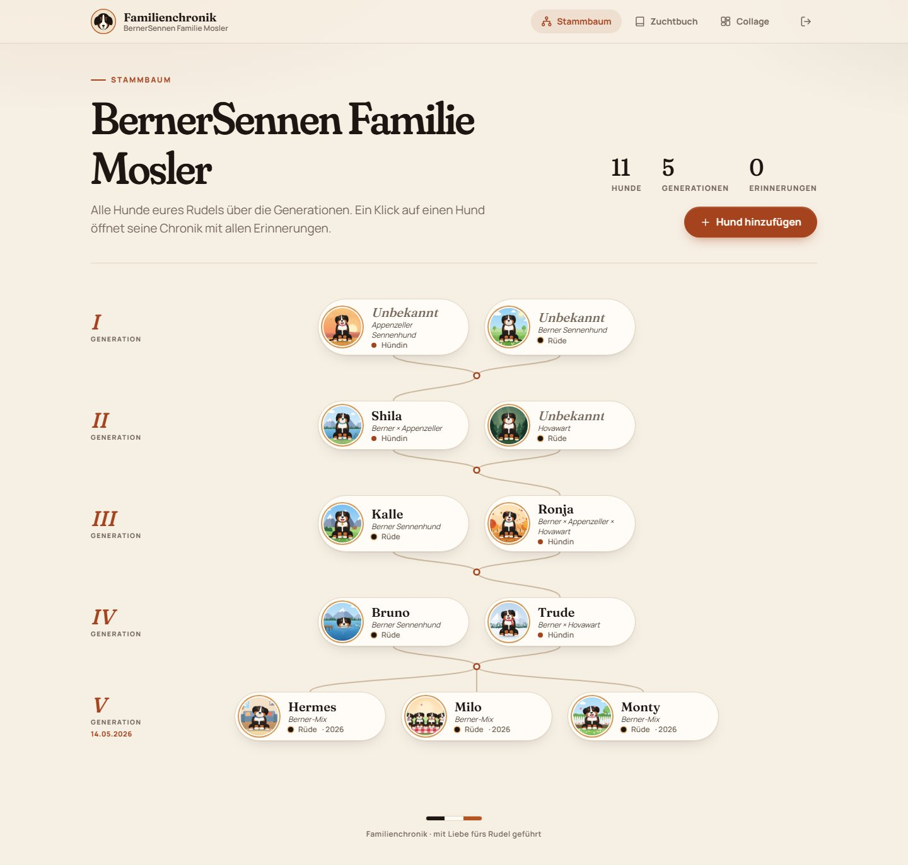
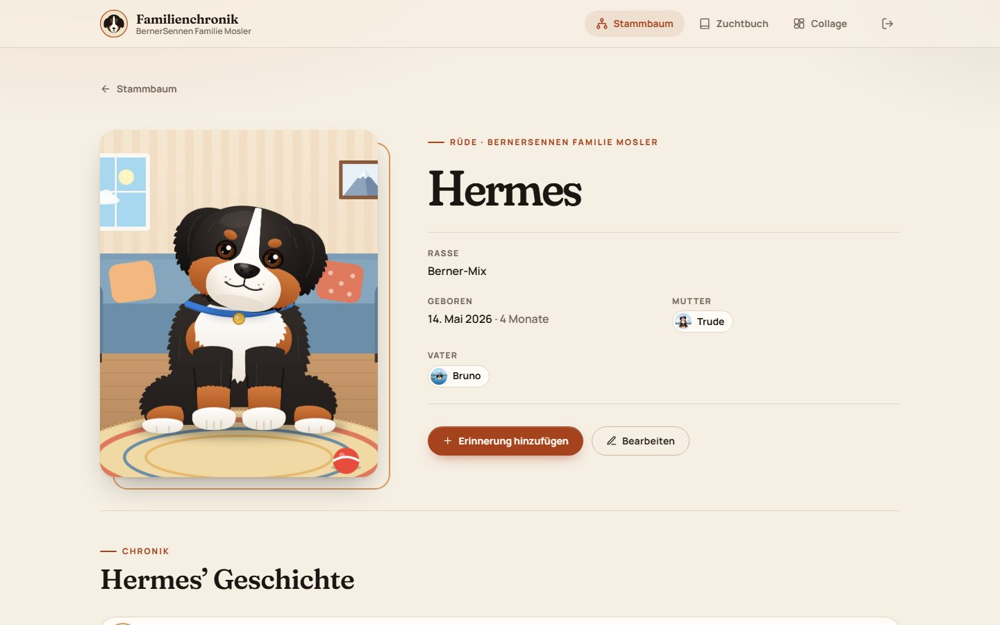
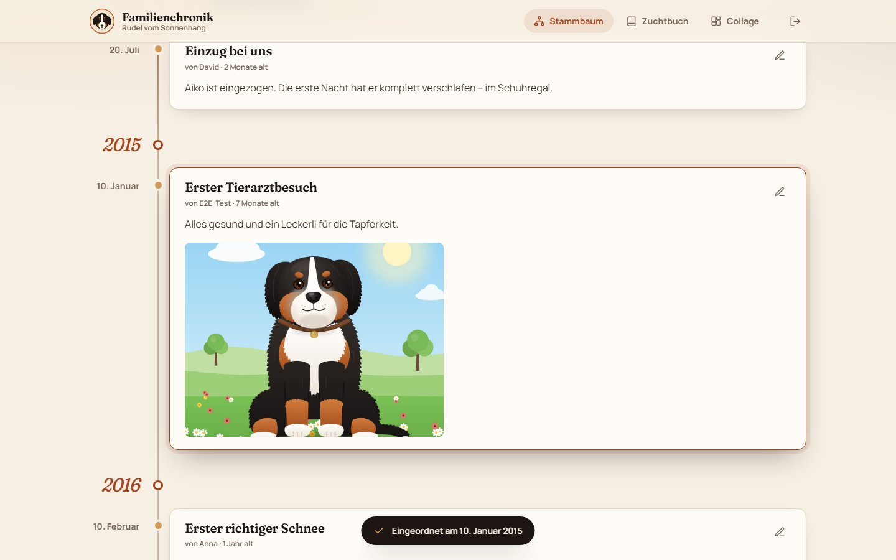
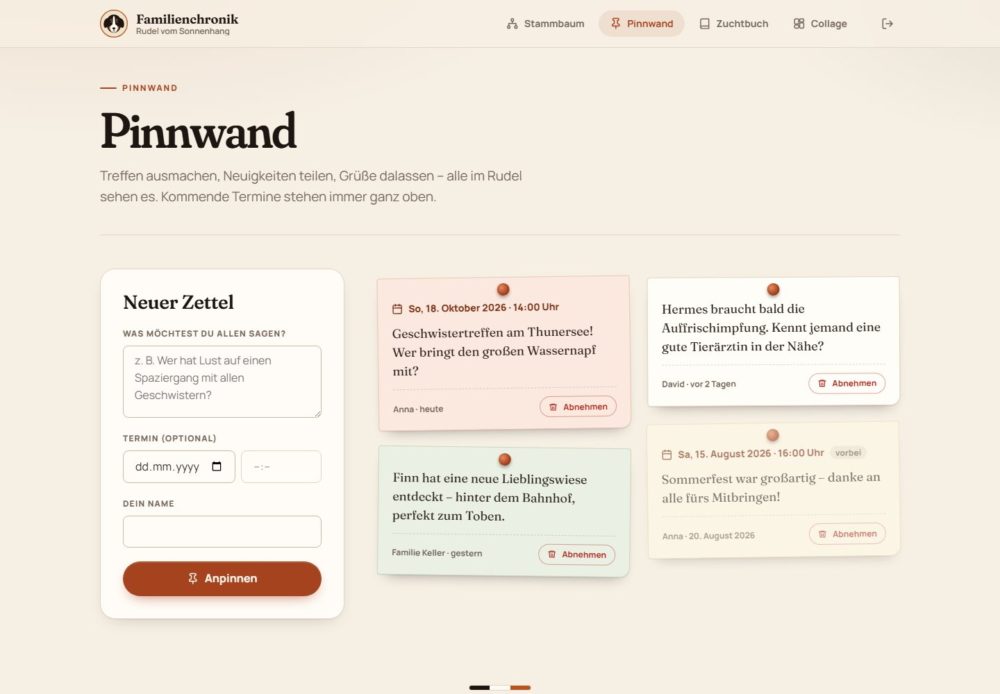
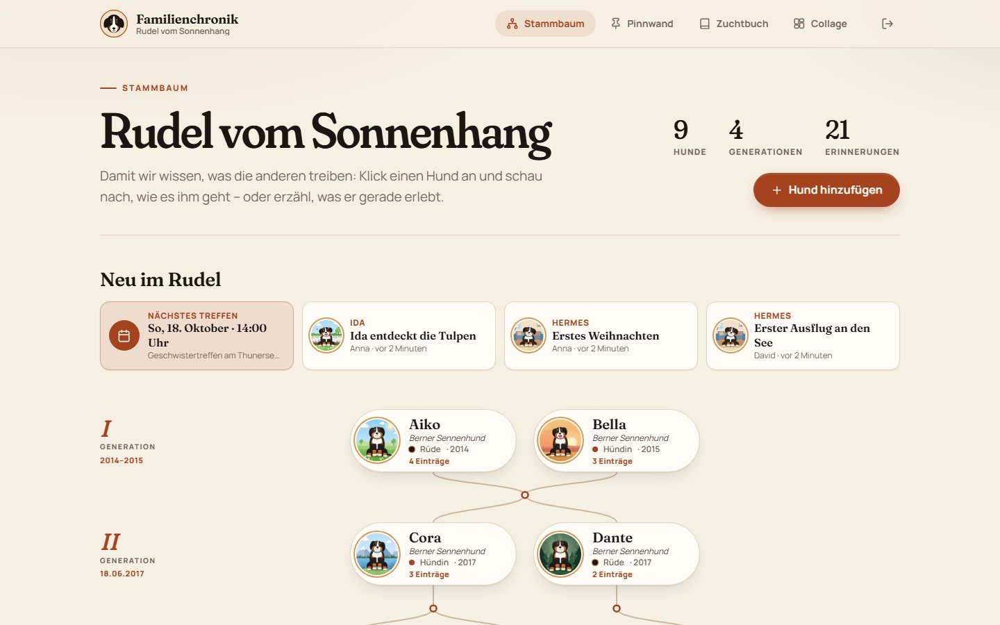
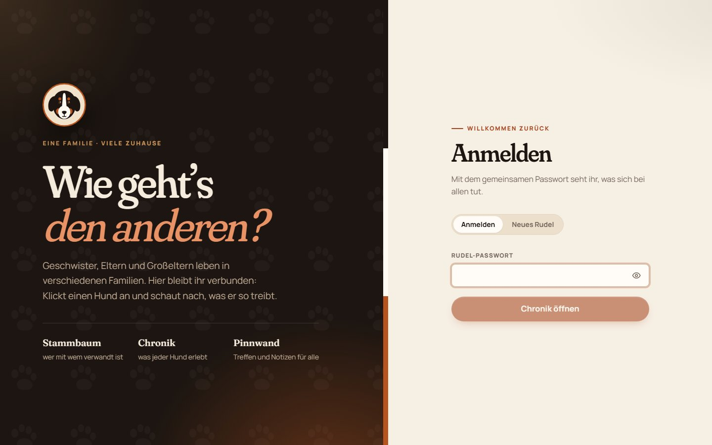
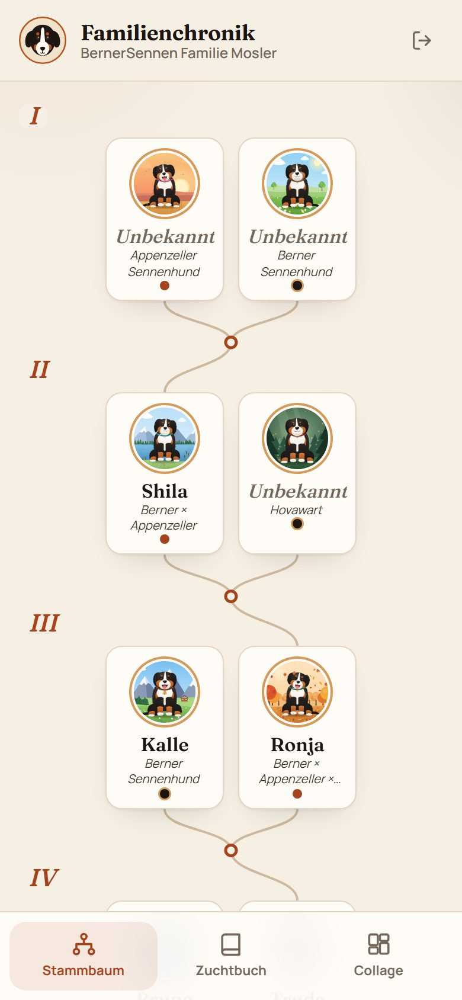

# Familienchronik – Berner Sennenhund Stammbaum

**Wie geht’s den anderen?** Geschwister, Eltern und Großeltern eines Wurfs leben meist in
verschiedenen Familien. Diese kleine Web-App hält sie verbunden: Klick einen Hund an und schau nach,
was er so treibt – mit Stammbaum über Generationen, einer Chronik pro Hund, einer gemeinsamen
Pinnwand für Treffen und Notizen, Wurf-Übersicht und druckbaren Collagen.



<table>
  <tr>
    <td width="50%"></td>
    <td width="50%"></td>
  </tr>
  <tr>
    <td></td>
    <td></td>
  </tr>
  <tr>
    <td></td>
    <td align="center"></td>
  </tr>
</table>

## Funktionen

- **Stammbaum**: Generationen werden automatisch berechnet, Eltern und Würfe mit Linien verbunden,
  jede Generation zeigt ihr Geburtsdatum bzw. ihre Geburtsjahre. Beim Überfahren eines Hundes wird
  seine Familie hervorgehoben, ein Klick öffnet seine Seite. Große Bäume lassen sich zoomen
  (Knöpfe oder Strg + Mausrad), mit der Maus verschieben, einpassen und im Vollbild ansehen und
  nutzen die volle Fensterbreite. „Kompakt“ zeigt ältere Generationen nur mit Porträt und Namen
  (per Klick auf die Generation auch einzeln) – die Linien bleiben verbunden.
- **Rasse & unbekannte Vorfahren**: Jeder Hund hat eine Rasse (auch Mischungen wie
  „Berner × Hovawart"). Vorfahren ohne bekannten Namen lassen sich mit „Name unbekannt" anlegen
  und erscheinen trotzdem als eigene Karte im Baum.
- **Mitbewohner & andere Tiere**: „Lebt zusammen mit" verbindet Tiere ohne gemeinsame
  Abstammung, etwa ein Tier aus dem Tierheim oder eine Katze. Ein Haus-Knopf am Tier klappt darunter eine
  eigene Mitbewohner-Reihe auf – der Wurf bleibt zusammen, die Karten tragen z. B.
  „lebt mit Hermes". Auf der Seite
  eines Hundes lässt sich ein Mitbewohner in einem Schritt neu anlegen (Tierart, Name, z. B. „Kaninchen").
- **Chronik pro Hund**: Einträge mit Datum, Text und Fotos. Das Datum bestimmt die Position.
  Ein Eintrag von 2018, der heute nachgetragen wird, landet automatisch zwischen 2017 und 2019.
  Geburt, Deckakte und Nachwuchs erscheinen als automatische Meilensteine. Alle im Rudel können
  Einträge kommentieren – mit ihrem Namen, wie auf der Pinnwand.
- **Neu im Rudel**: Über dem Stammbaum stehen das nächste Treffen und die zuletzt geschriebenen
  Einträge aller Hunde samt Anzahl der Kommentare – ein Klick springt direkt zum Eintrag.
- **Pinnwand**: Einfache Zettel für alle, optional mit Termin (Datum, Uhrzeit). Kommende Treffen
  stehen oben, vergangene rutschen ans Ende.
- **Würfe**: Entstehen automatisch aus dem Stammbaum – je Wurf die Eltern, alle Geschwister mit ihrem
  neuesten Eintrag und Chronik-Fotos im gleichen Alter („Als Welpen“, „Mit einem Jahr“ …). Vor dem
  Wurf-Geburtstag gibt es einen Hinweis samt „Treffen planen“ (fertiger Pinnwand-Zettel). Wer züchtet,
  trägt Deckakte ein: Sie erscheinen als erwarteter Wurf mit Countdown und später beim Wurf.
- **Collage**: A4-Collage aus Porträt, Chronik-Fotos und Eltern, Download als PNG.
- **Schreib dem Admin**: Feedback und Problemmeldungen gehen nur an den Admin – die anderen im
  Rudel sehen sie nicht. Der Name ist freiwillig, ohne Namen kommt die Nachricht anonym an.
- **Rudel mit Passwort**: Jedes Rudel hat ein gemeinsames Passwort und sieht nur seine eigenen
  Hunde, Einträge und Fotos. Zum Anlegen eines neuen Rudels braucht man optional einen Einladungscode.
- **Aussehen**: „Familie auf Pfoten“ (Pfoten-Logo, tierneutrale Texte: „Familie“, „Tier“) oder „Berner“
  (Wappen, Dreifarb-Streifen, „Rudel“, „Hund“). Jede Familie wählt selbst unter „Familie einstellen“ – mit
  Live-Vorschau. Bestehende Rudel behalten den Berner-Auftritt, neue starten mit „Familie auf Pfoten“.
- **Handy-tauglich**: kompakte Stammbaum-Karten, Navigation unten, Fotos werden vor dem Upload verkleinert.

Stack: Node.js/Express + SQLite (better-sqlite3), React + Vite, Caddy für HTTPS, keine externen
Dienste. Schriften werden selbst gehostet (keine Google-Fonts-Aufrufe).

## Lokal starten

Voraussetzung: Node.js 20 oder neuer.

```bash
npm run install:all
npm run seed      # optional: Beispiel-Rudel "Rudel vom Sonnenhang", Passwort: sonnenhang
npm run dev       # API auf :4000, Oberfläche auf http://localhost:5173
```

Unter Windows startet `start.bat` dasselbe per Doppelklick.

**Testumgebung mit eigenen Daten:** `npm run dev:test` (Windows: `start-test.bat`) startet Server und Client mit
Daten unter `server/.testenv/`, einem Test-Admin (`admin` / `test-admin`) und dem Band „Testsystem“.
`npm run testenv:reset` löscht die Testdaten und legt die Beispieldaten neu an. Die echte lokale Datenbank bleibt
unberührt.

| Befehl                          | Zweck                                          |
| ------------------------------- | ---------------------------------------------- |
| `npm test`                      | Server-Tests (node:test) und Client-Tests (Vitest) |
| `npm run build`                 | Produktions-Build der Oberfläche               |
| `npm run seed`                  | Beispiel-Rudel mit Testbildern anlegen         |
| `npm run db:reset -- -- --yes`  | Lokale Datenbank und Fotos löschen             |
| `npm --prefix server run family:delete -- "Name" --yes` | Ein Rudel samt Hunden und Fotos löschen |

## Auf einem Server betreiben (Docker + HTTPS)

Die App läuft als Container und lauscht nur auf `127.0.0.1:3010`. HTTPS davor macht der
**gemeinsame Caddy des Servers** (eigenes Repo `server`, auf dem Server in `/opt/proxy`), der
auch die anderen Projekte auf dem Server bedient. Er holt automatisch ein Zertifikat von
[Let's Encrypt](https://letsencrypt.org/getting-started/) für die Server-IP (Profil
`shortlived`, ca. 6 Tage gültig, Caddy erneuert selbstständig) und leitet
`https://SERVER-IP:3010` an die App weiter. Datenbank und Fotos liegen in `data/`.

Auf dem Server müssen **Port 80** (Zertifikatsprüfung) und **Port 3010** (HTTPS) erreichbar sein.
Ohne den Server-Proxy ist die App nur per SSH-Tunnel erreichbar:
`ssh -L 3010:127.0.0.1:3010 root@SERVER-IP` → `http://localhost:3010`.

### Mit `manage.ps1` (Windows)

1. `.deploy.env.example` nach `.deploy.env` kopieren und Server-IP eintragen.
2. `.\manage.ps1` starten, **[9] Erstinstallation** wählen. Das Skript installiert Docker,
   klont dieses Repo nach `/opt/bernersennen-stammbaum`, erzeugt eine `.env` mit zufälligem
   `JWT_SECRET` und Einladungscode und startet alles.
3. Später: **[3] Deploy** holt den neuesten Stand von GitHub und baut neu.

Weitere Menüpunkte: Status, Logs, Backup herunterladen, Einladungscode anzeigen,
öffentliche Demo neu anlegen, alle Daten löschen (mit automatischem Backup vorher).

**Vorschau (zweite Instanz):** Auf demselben Server läuft eine Vorschau mit Branch `staging` auf Port 3005 – nur
Beispieldaten, oben das Band „Vorschau“. `.deploy.staging.env.example` nach `.deploy.staging.env` kopieren, dann
`.\manage.ps1 -Target staging` (Erstinstallation mit **[9]**, Beispieldaten neu mit **[11]**). Freigegebene Stände
bringt `.\manage.ps1` → **[12]** nach Prod: `main` wird auf genau das getestete SHA vorgespult und dieses SHA
deployt. Jeder Deploy sichert vorher Datenbank, Fotos und `.env` (die letzten 10 Sicherungen bleiben liegen).
`remote.sh` bricht ab, wenn die übergebenen Werte (Port, Container, `APP_ENV`) nicht zur Instanz in `APP_DIR`
passen oder ein Deploy auf einen älteren Stand zurückspringen würde.

**Öffentliche Demo**: Auf der Login-Seite führt „Demo ansehen“ ohne Passwort in ein schreibgeschütztes
Beispiel-Rudel (vier Generationen, unbekannte Vorfahren, Mitbewohner, Chronik mit Kommentaren,
Pinnwand, Würfe). `deploy/remote.sh demo` bzw. **[7]** in `manage.ps1` legt sie neu an und
ersetzt dabei nur die Demo – echte Rudel bleiben unberührt.

Ein einzelnes Rudel löschen (auf dem Server im App-Ordner):
`docker compose exec chronik node scripts/delete-family.js "Name des Rudels" --yes`

### Manuell

```bash
git clone https://github.com/bavid/bernersennen-stammbaum.git && cd bernersennen-stammbaum
cp .env.example .env   # JWT_SECRET und PUBLIC_HOST setzen!
mkdir -p data && sudo chown 1000:1000 data
docker compose up -d --build
```

### Konfiguration (`.env`)

| Variable             | Bedeutung                                                              |
| -------------------- | ---------------------------------------------------------------------- |
| `JWT_SECRET`         | **Pflicht.** Zufälliges Secret für Session-Cookies                     |
| `PUBLIC_HOST`        | Server-IP oder Domain (für den HTTPS-Check nach dem Deploy)            |
| `HTTPS_PORT`         | Port der Seite (Standard 3010): App auf `127.0.0.1`, HTTPS außen per Server-Proxy |
| `FAMILY_INVITE_CODE` | Code zum Anlegen neuer Rudel (leer = jeder darf anlegen)               |
| `COOKIE_SECURE`      | `true` – Cookies nur über HTTPS                                        |
| `TRUST_PROXY`        | `1` – App steht hinter Caddy, Rate-Limit sieht echte IPs               |
| `APP_ENV`            | `production` (Standard), `staging` (Vorschau) oder `dev` – steuert Hinweis-Band und Beispieldaten |

Mit Domain: `PUBLIC_HOST=chronik.example.de` setzen und die Domain im Server-Proxy eintragen.

## Sicherheit

- HTTPS mit Let's-Encrypt-Zertifikat (Caddy), Cookies nur über HTTPS
- Strikte Trennung der Rudel: fremde Hunde sind per geänderter URL nicht abrufbar (404),
  Fotos nur mit Login
- Passwörter mit bcrypt gehasht, Session als httpOnly-Cookie (JWT, 30 Tage)
- Rate-Limit auf Login und Rudel-Anlage
- Uploads nur als JPG/PNG/WebP/GIF, Dateiname und Endung vergibt der Server
- Security-Header (CSP, nosniff, frame-ancestors) per helmet

## Projektstruktur

```
client/          React-Oberfläche (Vite)
  src/lib/       reine Logik: Stammbaum-Layout, Timeline, Datumsformat (mit Tests)
server/          Express-API + SQLite
  routes/        auth, dogs, timeline, breeding, uploads
  seed/          Demo-Daten und Testbilder
  scripts/       seed.js, demo.js, reset.js
deploy/remote.sh Server-Befehle (setup, deploy, backup, demo, showcase, wipe …)
manage.ps1       Windows-Menü für den Server
```
